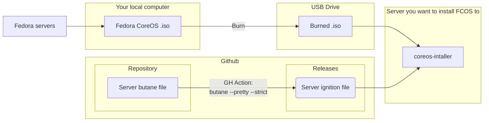

# fcos-ignition-config

Fedora CoreOS settings for my kubernetes nodes

## What this is for

I have a small cluster at home, and ever since I read about Red Hat CoreOS and Fedora CoreOS, the idea has intrigued me: an immutable OS that is meant as a base for containerized workloads? Sounds amazing! So I'll be adding to this repository all my progressions and goals towards making a somewhat clean and usable Fedora CoreOS setup.

> ⚠ NOTE
> These are my configs for my own servers!
> I'll try to keep everything as "boilerplate-y" as possible, and make an extra effort to mark every single config someone else might need to change for them to work, but it's up to you to do it!

## My current setup

Long story short: Fedora CoreOS uses something called an `ignition` file (.ign) to setup your PC, instead of having to set it up manually on every setup. These ignition files are glorified .json files that are generated from `butane` files (which are, in turn, glorified .yaml files)

Like so:

This ignition file can either:

1. Be manually put into the server you want to install this to (via pendrive)
2. Be embedded onto the ISO itself
3. Be downloaded on the go from a URL

I decided to go with option number 3, so let's host it on github!

### Github workflow

Since I'm doing testing and I need to reinstall often (until I get it just right), I wanted to automate it all so:

