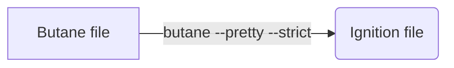

# fcos-ignition-config

Fedora CoreOS settings for my kubernetes nodes

[](https://github.com/juanlu-sanz/fcos-ignition-config/actions/workflows/main.yml)

## What this is for

I have a small cluster at home, and ever since I read about Red Hat CoreOS and Fedora CoreOS, the idea has intrigued me: an immutable OS that is meant as a base for containerized workloads? Sounds amazing! So I'll be adding to this repository all my progressions and goals towards making a somewhat clean and usable Fedora CoreOS setup.

> ⚠ NOTE
> These are my configs for my own servers!
> I'll try to keep everything as "boilerplate-y" as possible, and make an extra effort to mark every single config someone else might need to change for them to work, but it's up to you to do it!

## First things first, download Fedora CoreOS

Either from [their website](https://fedoraproject.org/coreos/download/?stream=stable#baremetal)

or

```bash
 podman run --security-opt label=disable --pull=always --rm -v .:/data -w /data quay.io/coreos/coreos-installer:release download -s stable -p metal -f iso
```

In any case, I like to rename the ISOs in case more pop up later (they will)

```bash
mv fedora-coreos-38.20230527.3.0-live.x86_64.iso fcosFromFedora.iso
```

## My current setup

Long story short: Fedora CoreOS uses something called an `ignition` file (.ign) to setup your PC, instead of having to set it up manually on every setup. These ignition files are glorified .json files that are generated from `butane` files (which are, in turn, glorified .yaml files)

Like so:



This ignition file can either:

1. Be manually put into the server you want to install this to (via pendrive)
2. Be embedded onto the ISO itself
3. Be downloaded on the go from a URL

I decided to go with option number 3, so let's host it on github!

### Github workflow

Since I'm doing some testing and I need to reinstall often (until I get it just right), I wanted to automate it all so:


To install you can do either of two things:

#### Option A) The easy way: pass the URL on every installation

You simply burn the ISO you just downloaded, boot your Fedora CoreOS live USB on your server, wait for it to "boot" and run

```bash
lsblk  # To make sure which drive is which on your server
sudo coreos-installer install <Drive you want to install it to> \
    --ignition-url https://yourdomain.com/yourIgnitionFile.ign
```

So, for example

```bash
sudo coreos-installer install /dev/sda \
    --ignition-url https://github.com/juanlu-sanz/fcos-ignition-config/releases/latest/download/k8s-node.ign
```

> ⚠ Don't use this exact command directly on your server! It'll install my configs!

Now if you make changes, you only need to push to git, a GH action will generate the appropiate ignition file and publish it, run the installer again and you have a brand new install!

#### Option B) The automatic way: make the installer pull the config on every install

This is only if you want to reinstall often! (ignition testing for example)

You can create another, small ignition file which is embedded in the ISO before burning and makes the ISO automatically set the two properties you need (destination disk and ignition file). The diagram looks like this:


The graph is more complex, but it certainly makes life easier! Now instead of having to plug a keyboard on the server and type the install command, just running the ISO will reinstall Fedora CoreOS with the latest version of your ignition file!

To do this, on your workstation run

```bash
podman run --security-opt label=disable --pull=always --rm -v .:/data -w /data quay.io/coreos/coreos-installer:release iso ignition embed -i config.ign -o myCustomFocs.iso focsFromFedora.iso
```

This is basically embedding the ISO with a small config saying "hey! when you live boot, just autoinstall there 👉🖴 with this ignition file 📝"

Now burn `myCustomFocs.iso` on a USB drive and boot from it! It'll automatically install!

## References

- [Official Fedora CoreOS docs](https://docs.fedoraproject.org/en-US/fedora-coreos/bare-metal/#_customizing_installation)
- [Official CoreOS installer docs](https://coreos.github.io/coreos-installer/cmd/install/)
- [Red Hat blog post on a basic install](https://developers.redhat.com/blog/2020/03/12/how-to-customize-fedora-coreos-for-dedicated-workloads-with-ostree#the_rpm_ostree_tool)
- [Tommy Tran's excellent youtube guide](https://www.youtube.com/watch?v=2eEiVYelFTo)
